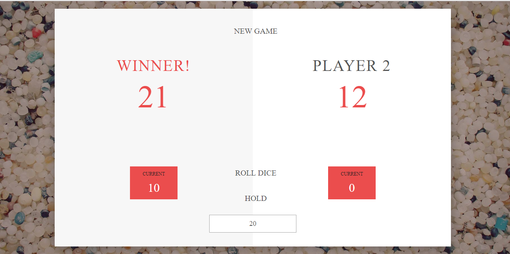

Pig Game

Pig is a simple dice game

Rules
1. If the player rolls a 1, they score nothing and it becomes the next player's turn.
2. If the player rolls any other number, it is added to their turn total and the player's turn continues.
3. If a player chooses to "hold", their turn total is added to their score, and it becomes the next player's turn.

Output

